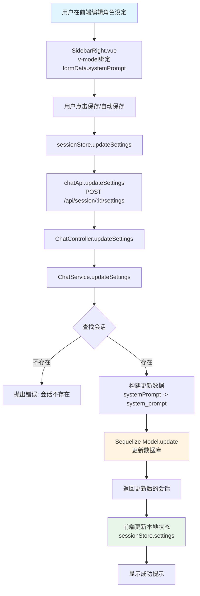
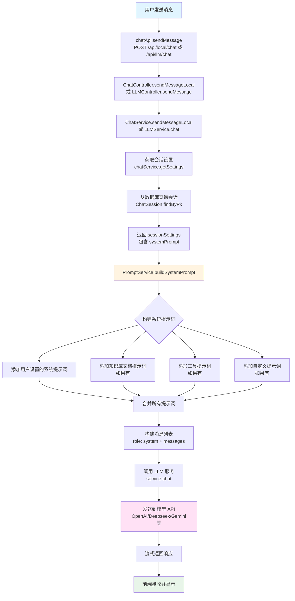

# 对话角色设定设置调用流程图

本文档描述了 eechat 项目中对话角色设定（System Prompt）的完整调用流程，包括前端界面、状态管理、API 调用、后端处理和数据库存储。

## 一、更新角色设定流程

下面的流程图展示了用户在前端编辑并保存角色设定的完整过程：



### 关键代码位置

- **前端组件**: `src/components/chat/SidebarRight.vue`
- **状态管理**: `src/stores/session.ts`
- **API 调用**: `src/api/request.ts` - `chatApi.updateSettings()`
- **后端控制器**: `electron/server/app/controller/chat.js` - `updateSettings()`
- **后端服务**: `electron/server/app/service/chat.js` - `updateSettings()`
- **数据模型**: `electron/server/app/model/chatSession.js`

## 二、发送消息时使用角色设定流程

下面的流程图展示了发送消息时如何获取并使用角色设定的完整过程：



### 关键代码位置

- **前端发送**: `src/api/request.ts` - `chatApi.sendMessage()` 或 `llmApi.sendMessageLlm()`
- **后端控制器**: `electron/server/app/controller/chat.js`
- **LLM 服务**: `electron/server/app/service/llm.js` - `chat()`
- **获取设置**: `electron/server/app/service/chat.js` - `getSettings()`
- **提示词构建**: `electron/server/app/service/prompt.js` - `buildSystemPrompt()`
- **LLM 实现**: `electron/server/app/service/llm/common.js` 或 `gemini.js`

## 三、数据流转图

下面的图展示了角色设定数据在整个系统中的流转过程：

```mermaid
flowchart LR
    subgraph 前端
        A1[SidebarRight.vue<br/>Textarea输入] --> A2[Pinia Store<br/>sessionStore.settings]
        A2 --> A3[API Request<br/>POST /api/session/:id/settings]
    end
    
    subgraph 后端 API
        B1[ChatController<br/>接收请求] --> B2[ChatService<br/>处理业务逻辑]
        B2 --> B3[数据转换<br/>systemPrompt -> system_prompt]
    end
    
    subgraph 数据库
        C1[(SQLite<br/>chat_session表)] --> C2[system_prompt字段<br/>TEXT类型]
    end
    
    subgraph 消息发送流程
        D1[获取会话设置] --> D2[PromptService<br/>构建系统提示词]
        D2 --> D3[添加到消息列表<br/>role: system]
        D3 --> D4[发送到 LLM]
    end
    
    A3 --> B1
    B3 --> C1
    C2 --> D1
    D4 --> E1[AI 模型响应]
    
    style A1 fill:#e1f5ff
    style C1 fill:#fff4e1
    style D4 fill:#ffe1f5
    style E1 fill:#e8f5e9
```



## 四、数据结构

### 前端数据结构

```typescript
interface SessionSettings {
  title: string
  systemPrompt: string        // 角色设定内容
  temperature: number[]
  top_p: number[]
  presence_penalty: number[]
  frequency_penalty: number[]
}
```

### 后端数据库结构

```javascript
// chat_session 表
{
  id: INTEGER,
  title: STRING(100),
  system_prompt: TEXT,        // 存储角色设定
  temperature: FLOAT,
  top_p: FLOAT,
  presence_penalty: FLOAT,
  frequency_penalty: FLOAT,
  // ... 其他字段
}
```

### API 接口

**更新设置**
- **路径**: `POST /api/session/:id/settings`
- **请求体**: 
  ```json
  {
    "systemPrompt": "You are a helpful assistant...",
    "temperature": [0.6],
    // ... 其他设置
  }
  ```

**获取设置**
- **路径**: `GET /api/session/:id/settings`
- **响应**: 
  ```json
  {
    "systemPrompt": "You are a helpful assistant...",
    "temperature": 0.6,
    // ... 其他设置
  }
  ```

## 五、提示词构建逻辑

`PromptService.buildSystemPrompt()` 方法会按以下顺序构建最终的系统提示词：

1. **用户设置的系统提示词**（角色设定）
   - 直接使用 `sessionSettings.systemPrompt`

2. **知识库文档提示词**（如果启用 RAG）
   - 调用 `buildDocsPrompt()` 构建

3. **工具提示词**（如果启用了 MCP 工具）
   - 调用 `buildToolsPrompt()` 构建

4. **自定义提示词**（如果配置了）
   - 调用 `buildCustomPrompt()` 构建

所有部分通过 `\n\n` 连接，最终作为 `role: 'system'` 的消息添加到消息列表的开头。

## 六、关键特性

1. **按会话存储**: 每个对话会话都有独立的角色设定
2. **实时更新**: 修改后立即保存到数据库
3. **自动应用**: 发送消息时自动获取并应用到对话中
4. **组合构建**: 系统提示词可以组合用户设定、知识库、工具等多种来源
5. **多语言支持**: 根据 `Accept-Language` 头自动选择提示词语言

## 七、相关文件清单

### 前端文件
- `src/components/chat/SidebarRight.vue` - 角色设定编辑界面
- `src/stores/session.ts` - 会话状态管理
- `src/api/request.ts` - API 调用封装
- `src/pages/chat.vue` - 聊天主页面

### 后端文件
- `electron/server/app/controller/chat.js` - 控制器层
- `electron/server/app/service/chat.js` - 会话服务
- `electron/server/app/service/prompt.js` - 提示词构建服务
- `electron/server/app/service/llm.js` - LLM 服务入口
- `electron/server/app/service/llm/common.js` - 通用 LLM 实现
- `electron/server/app/model/chatSession.js` - 数据模型

### 配置文件
- `public/promot.json` - 预设角色模板（中文）
- `public/promot_en-US.json` - 预设角色模板（英文）

