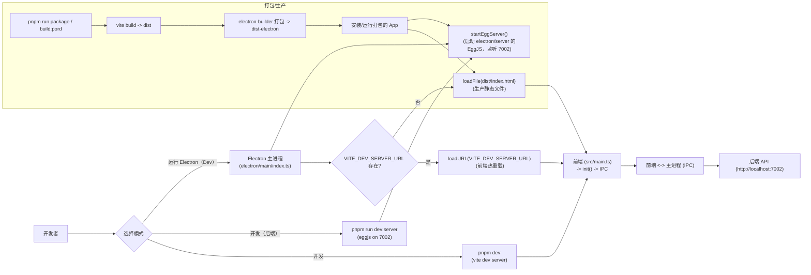

# 项目启动流程图

下面是 eechat 项目的启动流程图（Mermaid）：

```mermaid
%%{init: { 'theme': 'default' }}%%
```mermaid

```mermaid
%% 请在支持 mermaid 的渲染器中查看此图
```



简要说明：
- 开发模式时，`pnpm dev` 启动 Vite 前端（由 `src/main.ts` 作为入口），`pnpm run dev:server` 启动 `electron/server` 内的 EggJS（端口 7002）。
- Electron 主进程在存在 `VITE_DEV_SERVER_URL` 时会加载 dev server，否则加载打包后的静态 `dist/index.html`。主进程会调用 `startEggServer()` 启动内嵌后端。
